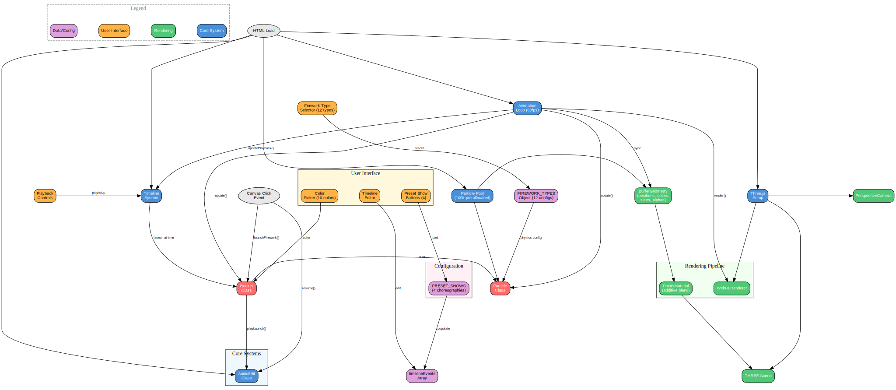
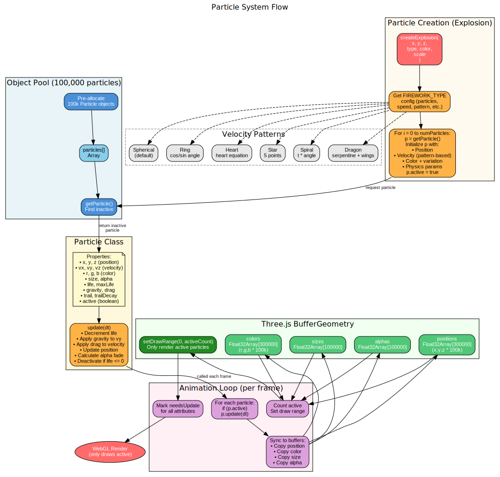
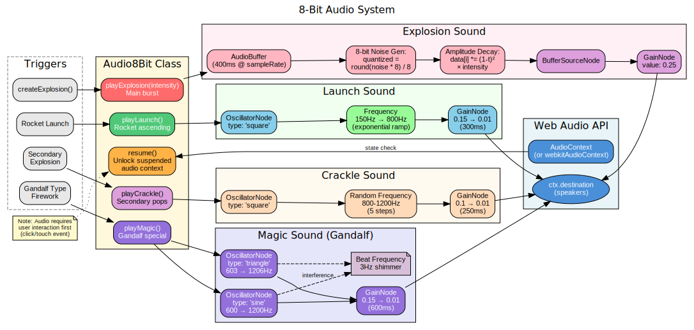
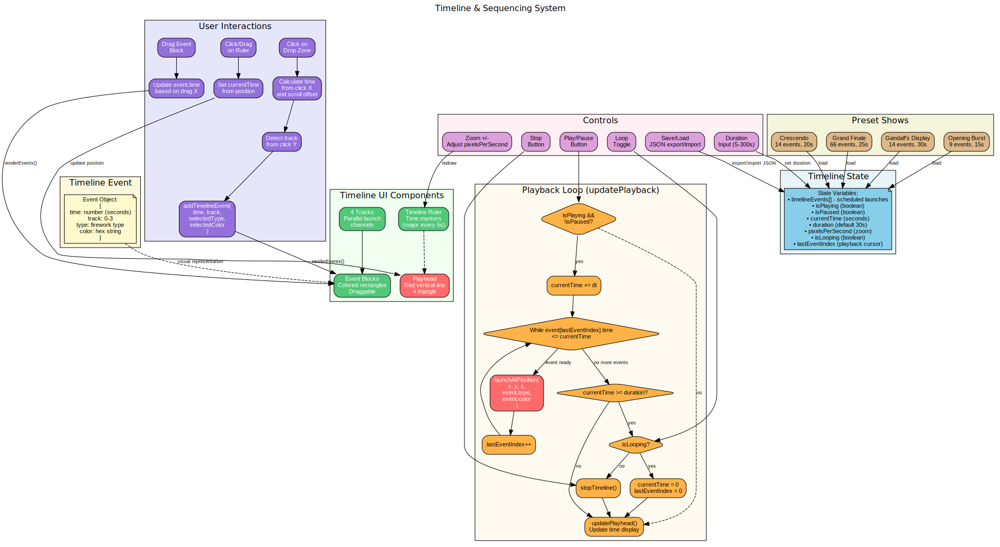

# Understanding the Fireworks Display Builder Architecture

Welcome to an interactive tour of how the Fireworks Display Builder works under the hood. This guide will take you from a bird's-eye view down to the intricate details of particle physics and procedural audio synthesis.

---

## Table of Contents

1. [The Big Picture](#1-the-big-picture)
2. [The Particle System](#2-the-particle-system)
3. [The Audio System](#3-the-audio-system)
4. [The Timeline System](#4-the-timeline-system)
5. [Putting It All Together](#5-putting-it-all-together)
6. [Key Takeaways](#6-key-takeaways)

---

## 1. The Big Picture

Before diving into specifics, let's understand how all the pieces connect.



### What You're Looking At

The architecture diagram reveals **five core systems** working in harmony:

| System | Responsibility |
|--------|---------------|
| **Audio8Bit** | Procedural 8-bit sound synthesis |
| **Three.js Setup** | 3D scene, camera, and WebGL rendering |
| **Particle Pool** | 100,000 pre-allocated particle objects |
| **Timeline System** | Sequencing firework launches over time |
| **Animation Loop** | 60fps game loop coordinating everything |

### The Data Flow

Follow the arrows to understand how data moves through the system:

```
User Click → Rocket Launch → Particle Explosion → Buffer Update → GPU Render
                ↓
            Audio Trigger → Web Audio API → Speakers
```

### Color Legend

The diagrams use consistent colors to help you identify component types:

- **Blue** = Core system components
- **Green** = Rendering/Three.js elements
- **Orange** = User interface elements
- **Purple** = Data/configuration objects
- **Red** = Runtime entities (Rockets, Particles)
- **Gray** = External triggers/events

---

## 2. The Particle System

This is where the magic happens. The particle system is the heart of the visual display.



### The Object Pool Pattern

> **Why 100,000 particles?**
> Creating and destroying JavaScript objects triggers garbage collection, which causes stutters. By pre-allocating all particles at startup, we eliminate runtime allocation entirely.

```javascript
// At startup: Create all particles once
for (let i = 0; i < 100000; i++) {
    particles[i] = new Particle();
}

// At runtime: Reuse inactive particles
function getParticle() {
    return particles.find(p => !p.active);
}
```

### Particle Anatomy

Each particle carries all the data needed for physics simulation:

| Property | Purpose |
|----------|---------|
| `x, y, z` | Current position in 3D space |
| `vx, vy, vz` | Velocity vector |
| `r, g, b` | RGB color values |
| `life / maxLife` | Countdown timer for fading |
| `gravity` | Downward acceleration |
| `drag` | Air resistance (velocity decay) |
| `trail` | Leave a trail behind? |
| `active` | Is this particle in use? |

### The Update Cycle

Every frame (60 times per second), each active particle runs this physics simulation:

```
1. life -= deltaTime          // Count down to death
2. vy -= gravity × deltaTime  // Gravity pulls down
3. velocity × = (1 - drag)    // Air resistance slows it
4. position += velocity       // Move the particle
5. alpha = life / maxLife     // Fade as it dies
6. if (life <= 0) active = false  // Return to pool
```

### Velocity Patterns

Different firework types create different explosion shapes:

| Pattern | Visual Effect | Math Behind It |
|---------|--------------|----------------|
| **Spherical** | Classic burst | Random point on sphere surface |
| **Ring** | Circular outline | `cos(θ)`, `sin(θ)` around a circle |
| **Heart** | Heart shape | Heart curve equation |
| **Star** | 5-pointed star | Alternating radii at 72° intervals |
| **Spiral** | Spinning trails | `θ × t` creates rotation |
| **Dragon** | Serpentine creature | Body wave + wing positions |

### GPU Optimization

The secret to smooth rendering is **BufferGeometry**:

```
Float32Array[300,000] for positions (x,y,z × 100k)
Float32Array[300,000] for colors (r,g,b × 100k)
Float32Array[100,000] for sizes
Float32Array[100,000] for alphas
```

By using typed arrays, we can upload data directly to the GPU without conversion. The `setDrawRange()` call ensures we only render active particles, not all 100k.

---

## 3. The Audio System

The audio is entirely procedural—no sound files needed. Everything is synthesized in real-time using the Web Audio API.



### The 8-Bit Aesthetic

> **Why 8-bit?**
> By quantizing audio values to discrete steps, we create that nostalgic chiptune sound that perfectly matches the playful visual style.

```javascript
// 8-bit quantization
quantized = Math.round(noise * 8) / 8;
```

### Sound Breakdown

#### Launch Sound (Rocket Ascending)
- **Type**: Square wave oscillator
- **Frequency**: 150Hz → 800Hz (exponential ramp)
- **Gain**: 0.15 → 0.01 over 300ms
- **Effect**: Rising whistle

#### Explosion Sound (Main Burst)
- **Type**: Noise buffer with decay envelope
- **Formula**: `noise × (1-t)² × intensity`
- **Duration**: 400ms
- **Effect**: Punchy boom with adjustable intensity

#### Crackle Sound (Secondary Pops)
- **Type**: Square wave with random frequency steps
- **Frequency**: 800-1200Hz (jumps 5 times)
- **Effect**: Staccato crackling

#### Magic Sound (Gandalf Special)
- **Type**: Two oscillators (sine + triangle)
- **Frequencies**: 600→1200Hz and 603→1206Hz
- **Secret**: The 3Hz difference creates a **beat frequency** shimmer
- **Effect**: Ethereal, mystical tone

### Audio Chain Diagram

```
Oscillator → GainNode → AudioContext.destination (speakers)
     ↓
Frequency changes over time
     ↓
Gain envelope controls volume
```

### Browser Audio Unlock

Modern browsers require user interaction before playing audio. The system handles this automatically:

```javascript
canvas.addEventListener('click', () => {
    if (audioContext.state === 'suspended') {
        audioContext.resume();
    }
});
```

---

## 4. The Timeline System

The timeline transforms individual fireworks into choreographed shows.



### Timeline State

The system tracks these key variables:

```javascript
{
    timelineEvents: [],     // Array of scheduled launches
    isPlaying: false,       // Currently playing?
    isPaused: false,        // Paused mid-playback?
    currentTime: 0,         // Playhead position (seconds)
    duration: 30,           // Total show length
    lastEventIndex: 0,      // Optimization: last triggered event
    isLooping: false        // Repeat when done?
}
```

### Event Structure

Each firework launch is stored as a simple object:

```javascript
{
    time: 2.5,           // When to launch (seconds)
    track: 0,            // Which lane (0-3)
    type: 'peony',       // Firework type
    color: '#FF6B6B'     // Explosion color
}
```

### The Playback Algorithm

```
┌─────────────────────────────────────────┐
│ Every frame (when playing):             │
├─────────────────────────────────────────┤
│ 1. currentTime += deltaTime             │
│                                         │
│ 2. While events[lastEventIndex].time    │
│    <= currentTime:                      │
│      → Launch that firework             │
│      → lastEventIndex++                 │
│                                         │
│ 3. If currentTime >= duration:          │
│      → Loop back OR stop                │
│                                         │
│ 4. Update playhead position             │
└─────────────────────────────────────────┘
```

The `lastEventIndex` optimization prevents checking already-triggered events.

### User Interactions

| Action | Result |
|--------|--------|
| Click on track | Add event at that time |
| Drag event block | Move event to new time |
| Click on ruler | Scrub playhead to position |
| Drag on ruler | Seek through timeline |

### Preset Shows

Four built-in choreographies demonstrate the system:

| Preset | Events | Duration | Style |
|--------|--------|----------|-------|
| Opening Burst | 9 | 15s | Quick introduction |
| Crescendo | 14 | 20s | Building intensity |
| Grand Finale | 66 | 25s | Rapid-fire spectacle |
| Gandalf's Display | 14 | 30s | Magical theme |

---

## 5. Putting It All Together

Now let's trace a complete firework from click to explosion:

### The Journey of a Single Firework

```
┌──────────────────────────────────────────────────────────────┐
│ 1. USER CLICKS CANVAS                                        │
│    → Get click coordinates                                   │
│    → Resume audio context (if needed)                        │
├──────────────────────────────────────────────────────────────┤
│ 2. CREATE ROCKET                                             │
│    → new Rocket(x, y, targetHeight, type, color)            │
│    → audio.playLaunch()                                      │
├──────────────────────────────────────────────────────────────┤
│ 3. ROCKET UPDATE LOOP (each frame)                           │
│    → rocket.y += velocity                                    │
│    → Spawn trail particles (if enabled)                      │
│    → Check if target height reached                          │
├──────────────────────────────────────────────────────────────┤
│ 4. EXPLOSION                                                 │
│    → createExplosion(x, y, z, type, color)                  │
│    → Get FIREWORK_TYPE config                                │
│    → For each particle count:                                │
│        → getParticle() from pool                             │
│        → Set velocity (pattern-based)                        │
│        → Set color with variation                            │
│        → particle.active = true                              │
│    → audio.playExplosion(intensity)                          │
├──────────────────────────────────────────────────────────────┤
│ 5. PARTICLE UPDATE LOOP (each frame)                         │
│    → For each active particle:                               │
│        → particle.update(deltaTime)                          │
│        → Copy to BufferGeometry arrays                       │
│    → Count active particles                                  │
│    → setDrawRange(0, activeCount)                            │
│    → Mark attributes needsUpdate                             │
├──────────────────────────────────────────────────────────────┤
│ 6. RENDER                                                    │
│    → renderer.render(scene, camera)                          │
│    → GPU draws all active particles                          │
│    → requestAnimationFrame() → back to step 3                │
└──────────────────────────────────────────────────────────────┘
```

### Performance Budget

At 60 FPS, each frame has **16.67ms** to complete:

| Task | Typical Time |
|------|-------------|
| Update rockets | ~0.1ms |
| Update particles | ~2-4ms |
| Sync buffers | ~1-2ms |
| WebGL render | ~5-8ms |
| **Total** | **~8-14ms** |

This leaves headroom for complex shows with thousands of simultaneous particles.

---

## 6. Key Takeaways

### Performance Patterns

1. **Object Pooling**: Pre-allocate, don't create during runtime
2. **Typed Arrays**: Use Float32Array for GPU data
3. **Draw Range**: Only render what's active
4. **Additive Blending**: Particles glow where they overlap

### Architectural Patterns

1. **Separation of Concerns**: Each system handles one job
2. **Event-Driven**: Timeline triggers launches, explosions trigger audio
3. **Configuration Objects**: FIREWORK_TYPES makes adding new types trivial
4. **Single File**: Everything in one HTML file for easy distribution

### Audio Synthesis Techniques

1. **Oscillator Types**: Square for 8-bit, sine/triangle for smooth
2. **Envelope Shaping**: Gain ramps create natural decay
3. **Beat Frequencies**: Slight detuning creates shimmer
4. **Noise Buffers**: Pre-generated noise for explosions

---

## Further Exploration

Want to dig deeper? Here's where to find each system in the source code:

| System | Location |
|--------|----------|
| Audio System | Lines 556-655 |
| Three.js Setup | Lines 659-712 |
| Particle Pool | Lines 714-773 |
| BufferGeometry | Lines 775-832 |
| Firework Types | Lines 834-966 |
| Rocket Class | Lines 1138-1241 |
| Timeline System | Lines 1243-1448 |
| Preset Shows | Lines 1571-1678 |
| Animation Loop | Lines 1680-1772 |

Happy exploring!
